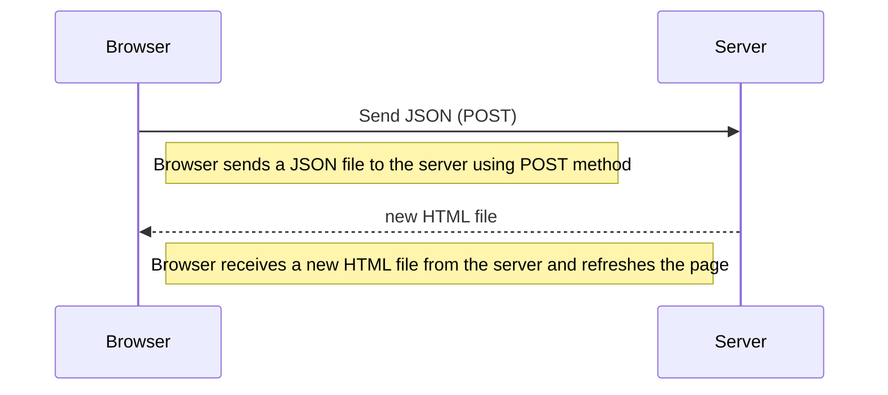

```mermaid
sequenceDiagram
    participant Browser
    participant Server

    Browser->>Server: Send JSON (POST)
    Note right of Browser: Browser sends a JSON file to the server using POST method

    Server-->>Browser: new HTML file
    Note right of Browser: Browser receives a new HTML file from the server and refreshes the page
```