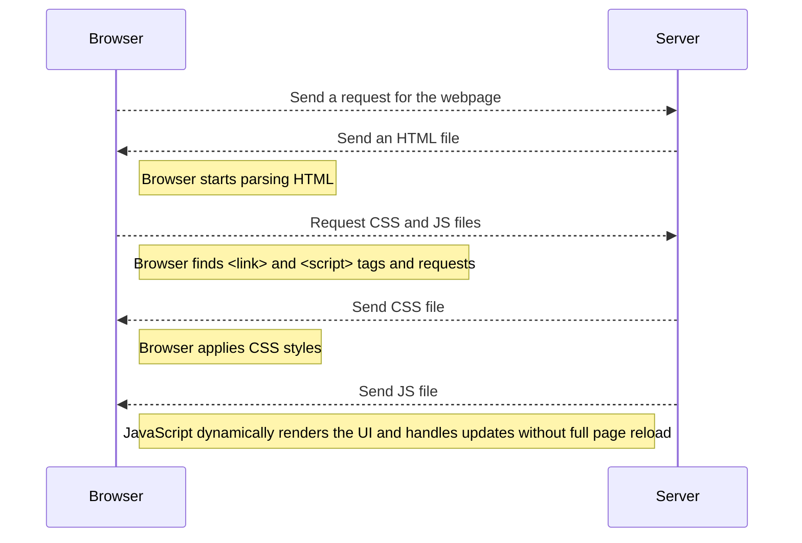

```mermaid
sequenceDiagram
    participant Browser
    participant Server

    Browser-->>Server: Send a request for the webpage

    Server-->>Browser: Send an HTML file
    Note right of Browser: Browser starts parsing HTML

    Browser-->>Server: Request CSS and JS files
    Note right of Browser: Browser finds <link> and <script> tags and requests

    Server-->>Browser: Send CSS file
    Note right of Browser: Browser applies CSS styles

    Server-->>Browser: Send JS file
    Note right of Browser: JavaScript dynamically renders the UI and handles updates without full page reload
```