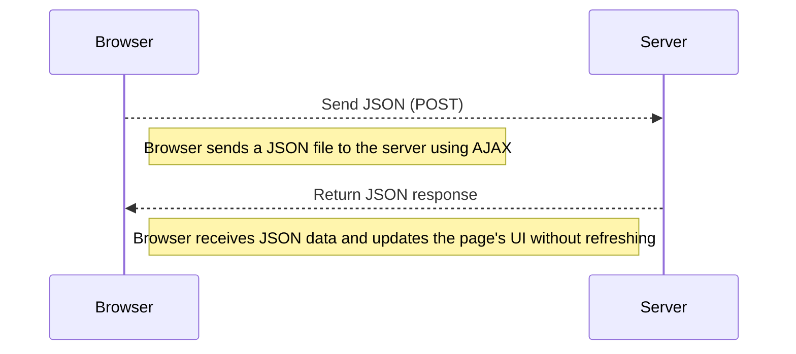

```mermaid
sequenceDiagram
    participant Browser
    participant Server

    Browser-->>Server: Send JSON (POST)
    Note right of Browser: Browser sends a JSON file to the server using AJAX

    Server-->>Browser: Return JSON response
    Note right of Browser: Browser receives JSON data and updates the page's UI without refreshing
```